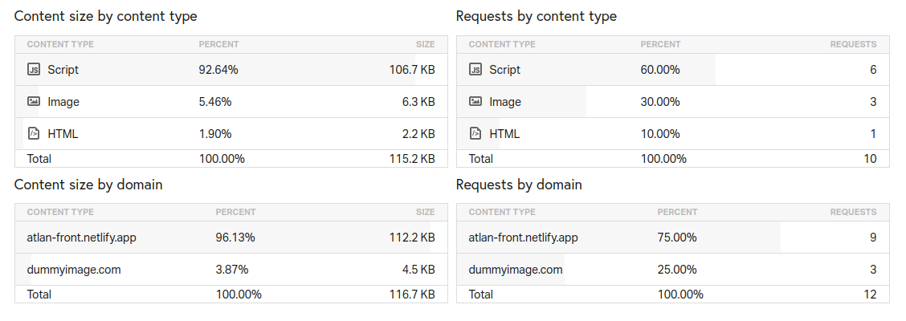
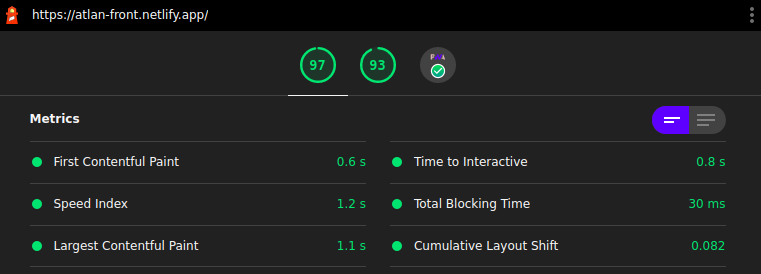

# Atlan-frontend
Atlan frontend intern hiring challenge

### `Page load time : 2.45 seconds`
Analysis via pingdom (Japan server) - [see results](https://tools.pingdom.com/#5d735c4557000000)

### `Time to interactive : 0.8 seconds`
Analysis via lighthouse audit (Desktop)

## Steps taken to improve page load time
+ I did not use any UI library and used handcrafted Tailwind CSS components, that improved a lot of speed and decreased the bundle size with the help of purgecss.
+ Added the PWA to plugin for faster load times on subsequent visit.
+ Using formats like .webp helps optimize the images a lot but for now I have used dummy .png images, and as they are single coloured, they are quite smaller than jpeg.